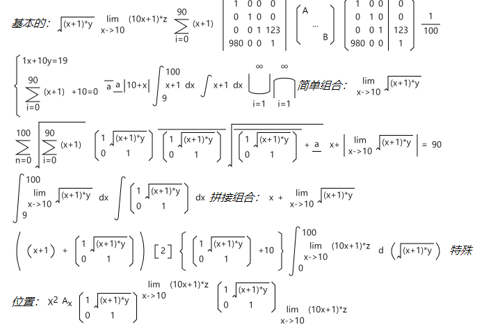

# knowpedia
为knowpedia项目定制的前端框架。

<p align="center">
    
</p>

<p align="center">
  <a href="https://hai2007.gitee.io/npm-downloads?interval=7&packages=knowpedia"></a>
  <a href="https://packagephobia.now.sh/result?p=knowpedia"></a>
  <a href="https://www.npmjs.com/package/knowpedia"></a>
  <a href="https://github.com/knowpedia/knowpedia/blob/master/LICENSE"></a>
    <a href="https://github.com/knowpedia/knowpedia" target='_blank'></a>
</p>

## Issues
使用的时候遇到任何问题或有好的建议，请点击进入[issue](https://github.com/knowpedia/knowpedia/issues)！

## How to use?

本项目是基于[Quick Paper](https://github.com/hai2007/quick-paper)进行的二次开发，专门为编辑特殊文本而进行了定制化，因此，基本的使用说明请查看[Quick Paper文档](https://hai2007.gitee.io/quick-paper)。

## 特有功能

下面，我们来列举出 ```knowpedia``` 框架特有的功能！

### 数学公式



首先，你需要在数据中定义公式，语法如下：

```js
data(){
    return {
        mathFormulas:{}
    };
},
 mounted() {
    this.mathFormulas = {
        // 返回的类型是公式对象
        <形参>: this.$mathFormula.<公式生成方法>(公式对象或字符串,......)
    };
},
```

然后，你可以在页面中借助指令显示出来了：

```html
<span kp-math-formula="mathFormulas.<形参>"></span>
```

下面列举出所有『公式生成方法』：

- 拼接

```js
// 从左到右，拼接起来
this.$mathFormula.join(...p);
```

- 根号

```js
this.$mathFormula.gen(p1);
```

- 极限

```js
// p1表示趋向，p2是计算结果的表达式
this.$mathFormula.limt(p1, p2);
```

- 求和

```js
// p1表示开始，p2是结束的值，p3是需要求和的表达式
this.$mathFormula.sum(p1, p2, p3);
```

- 矩阵和行列式

```js
// 第一个参数是一个二维数组
// 第二个参考默认false，表示矩阵，可选，如果是true，表示行列式
this.$mathFormula.matrix(p1, p2);
```

- 除

```js
this.$mathFormula.division(p1, p2);
```

- 括号

```js
// p2表示括号的类型，可选的有：
// small、middle、big，分别表示，小括号、中括号、大括号
this.$mathFormula.bracket(p1, p2);
```

- 特殊位置

```js
this.$mathFormula.rightTop(p1, p2);// p2在右上角
this.$mathFormula.rightBottom(p1, p2);// p2在右下角
```

- 方程组

```js
this.$mathFormula.equationSet(...p);
```

- 上下线

```js
this.$mathFormula.upLine(p1);// p1上面有线条
this.$mathFormula.downLine(p1);// p1下面有线条
```

- 绝对值

```js
this.$mathFormula.absoluteValue(p1);
```

- 定积分和不定积分

```js
// p1是表达式，p2表示对谁积分
// p3和p4可选，表示定积分积分范围（下、上）
this.$mathFormula.integral(p1, p2, p3, p4);
```

- 可列交和可列并

```js
this.$mathFormula.listedAnd(p1, p2); // 可列交
this.$mathFormula.listedOr(p1, p2); // 可列并
```

开源协议
---------------------------------------
[MIT](https://github.com/knowpedia/knowpedia/blob/master/LICENSE)

Copyright (c) 2021 [hai2007](https://hai2007.gitee.io/sweethome/) 走一步，再走一步。
